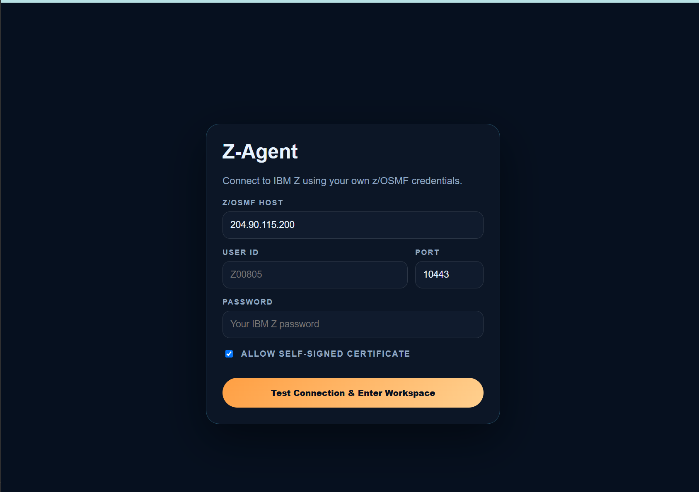
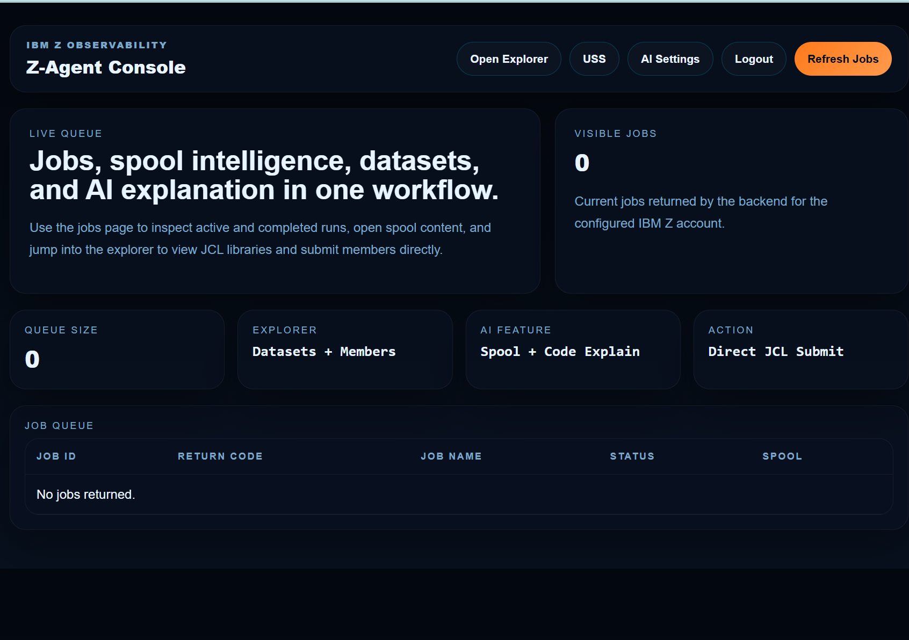
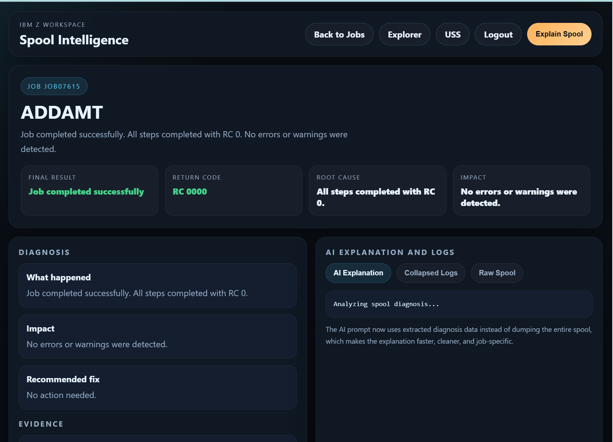
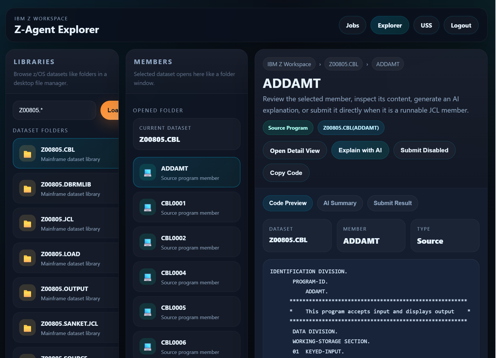
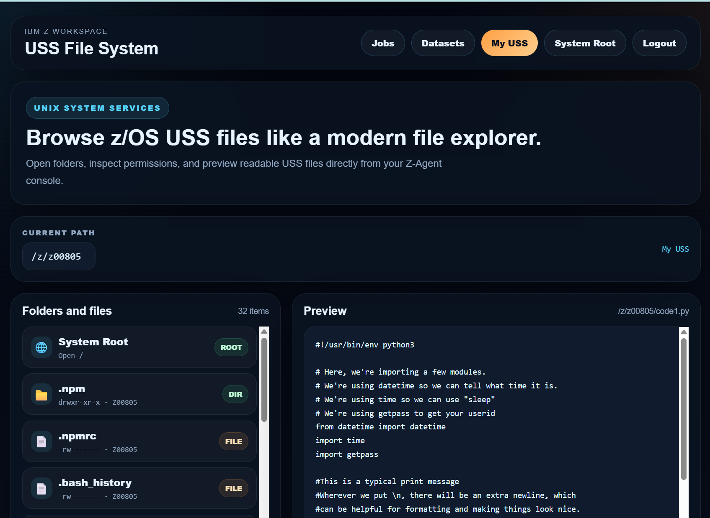
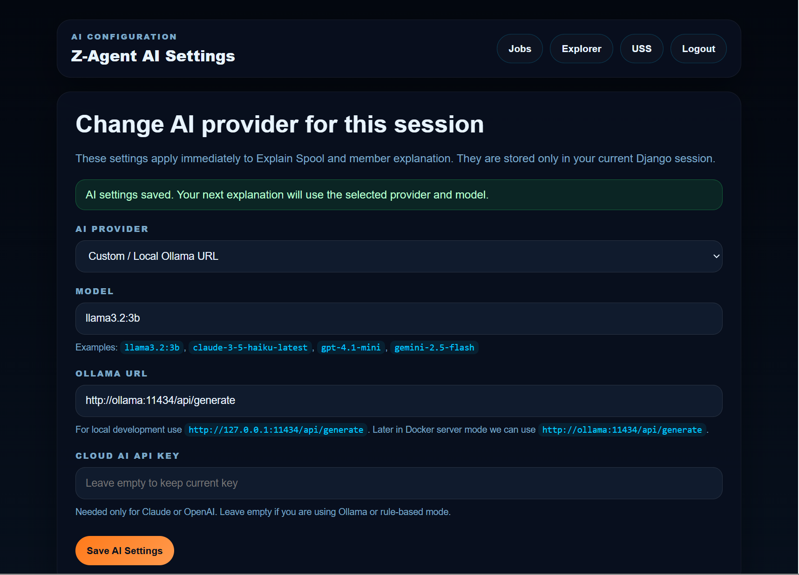

# Z-Agent

Z-Agent is a browser-based MainframeOps assistant built with Zowe CLI, Python, Django, FastAPI, Docker, and pluggable AI providers.

It helps developers, junior mainframers, DevOps teams, and support teams understand IBM Z jobs, spool output, datasets, USS files, and job failure explanations from one modern web workspace.

Zowe gives access. Z-Agent adds guidance.

---

## What Z-Agent Does

Z-Agent connects to IBM Z through Zowe CLI and provides a guided workflow for common mainframe job operations.

Z-Agent can:

- Connect to IBM Z using a browser setup page
- Store IBM Z connection details in the current session
- List jobs from z/OS
- Open job spool output
- Detect job result, return code, and failure type
- Extract useful evidence from spool output
- Explain job failures in plain English
- Browse datasets and members
- Submit JCL from the browser
- Browse USS files
- Switch between different AI providers and models
- Run locally or on a server using Docker Compose

---

## Why Z-Agent?

Mainframe job output can be difficult to understand, especially for beginners and junior developers.

A failed job may contain JES messages, JCL errors, COBOL compiler messages, ABENDs, return codes, dataset allocation errors, or long spool output.

Today, users often need to manually search through spool output or ask a senior mainframe expert.

Z-Agent improves this workflow by extracting the important facts and explaining them clearly.

---

## Core Design Principle

Z-Agent does not ask AI to guess the job result directly.

The workflow is:

1. Python reads the spool output.
2. Python extracts the factual diagnosis.
3. Z-Agent builds a clean explanation request.
4. The selected AI provider explains the diagnosis.

Python decides the facts. AI explains the facts.

This helps reduce hallucination and keeps the explanation evidence-based.

---

## Architecture

Browser
  -> Django Frontend
  -> FastAPI Backend
  -> Zowe CLI
  -> z/OSMF
  -> IBM Z

AI explanation flow:

Spool Output
  -> Python Diagnosis Logic
  -> Structured Diagnosis and Evidence
  -> AI Gateway
  -> Ollama / Gemini / Claude / OpenAI / Rule-only
  -> Plain-English Explanation

---

## Main Components

### Django Frontend

The Django frontend provides:

- Setup page
- Jobs dashboard
- Spool viewer
- Dataset Explorer
- USS Browser
- AI Settings page
- Session handling
- Logout

### FastAPI Backend

The FastAPI backend provides APIs for:

- Jobs
- Spool output
- Dataset operations
- USS operations
- JCL submission
- AI explanation

### Zowe CLI

Zowe CLI is the access foundation.

Z-Agent uses Zowe CLI to communicate with IBM Z through z/OSMF.

### AI Gateway

The AI Gateway makes Z-Agent model-agnostic.

Supported modes include:

- Rule-only mode
- Server Ollama
- Custom Ollama
- Gemini
- Claude
- OpenAI

---

## AI Operations Preview

z-agent can analyze IBM Z job spool output using a local Ollama model and
return a structured explanation with likely cause, evidence, suggested next
step, confidence, and audit ID.

AI explanations are advisory only and are processed through the safety and
audit layer.

The workflow is:

```
IBM Z job spool output
  -> sensitive data masking
  -> Ollama AI explanation
  -> structured result
  -> audit log entry
  -> UI/API result
```

Spool text is masked before it is sent to the model. Sensitive values
(passwords, tokens, dataset names, IPs, emails, account-like identifiers) are
replaced with placeholders, so raw secrets never reach the AI runtime.

See:

- docs/ai-operations.md
- docs/ai-safety.md
- docs/demo-ai-spool-explanation.md

---

## DevOps Integration Preview

z-agent provides pipeline-friendly APIs that can summarize IBM Z job results,
optionally include AI-assisted spool analysis, generate incident summaries,
and support dry-run webhook notifications.

This allows Jenkins, GitHub Actions, GitLab CI, Azure DevOps, and other
automation tools to consume IBM Z job status in a structured and auditable way.

Key endpoints:

- `POST /api/devops/job-summary` — structured job summary with `safe_to_continue`
- `POST /api/devops/incident-summary` — paste-ready incident first-pass summary
- `POST /api/devops/notify` — webhook notification (dry-run by default)

See:

- docs/devops-integration.md
- docs/pipeline-examples.md
- docs/incident-routing.md
- examples/jenkins, examples/github-actions, examples/api

---

## Current Features

- Browser-based IBM Z setup page
- Session-based IBM Z profile
- Jobs dashboard
- Job spool viewer
- Rule-based spool diagnosis
- AI-assisted explanation
- Dataset Explorer
- Member viewer
- JCL submit support
- USS Browser
- AI provider and model switching
- Dockerized deployment
- Local/server Ollama support
- Optional cloud AI provider support

---

## Quick Start with Docker

Build and start the application:

    docker compose up -d --build

Open the app:

    http://localhost:8001

For a server deployment:

    http://SERVER_IP:8001

---

## Ollama Setup

If you use Docker Compose, Ollama runs as a separate container.

Pull a local model:

    docker exec -it z-agent-ollama ollama pull llama3.2:3b

In server Docker mode, the internal Ollama URL is:

    http://ollama:11434/api/generate

In local non-Docker mode, the Ollama URL is usually:

    http://127.0.0.1:11434/api/generate

---

## Local Development

Create and activate a local Python virtual environment:

    python3 -m venv venv
    source venv/bin/activate
    pip install -r requirements.txt

Do not commit the virtual environment to Git.

---

## Repository Hygiene

Do not commit:

- .env
- zowe.config.json
- zowe.schema.json
- API keys
- passwords
- certificates
- private keys
- virtual environments
- cache folders
- local databases
- real production spool output

Use .env.example only for safe example configuration.

---

## Sandbox Candidate Package

z-agent includes a Sandbox candidate package with project positioning,
architecture, Open Mainframe alignment, Zowe comparison, use cases,
governance, known limitations, and demo materials for community feedback.

See:

- docs/sandbox-candidate-checklist.md
- docs/project-pitch.md
- docs/demo-script.md
- docs/architecture.md
- docs/known-limitations.md
- docs/release-checklist.md
- docs/security-review-checklist.md
- docs/open-mainframe-alignment.md
- docs/comparison-with-zowe.md
- docs/landscape.md
- docs/use-cases.md
- docs/sandbox-proposal-draft.md
- docs/good-first-issues.md
- docs/faq.md

---

## Documentation

More documentation is available in the docs folder:

- docs/architecture.md
- docs/ai-gateway.md
- docs/ai-operations.md
- docs/ai-safety.md
- docs/demo-ai-spool-explanation.md
- docs/demo-script.md
- docs/security-model.md
- docs/security-review-checklist.md
- docs/setup.md
- docs/demo.md
- docs/zowe-integration.md
- docs/open-mainframe-alignment.md
- docs/comparison-with-zowe.md
- docs/landscape.md
- docs/use-cases.md
- docs/devops-integration.md
- docs/pipeline-examples.md
- docs/incident-routing.md
- docs/known-limitations.md
- docs/release-checklist.md
- docs/sandbox-candidate-checklist.md
- docs/sandbox-proposal-draft.md
- docs/project-pitch.md
- docs/good-first-issues.md
- docs/faq.md
- docs/open-mainframe-sandbox-readiness.md

---

## Roadmap

See ROADMAP.md.

Near-term goals include:

- Better public documentation
- Screenshots and demo video
- More spool diagnosis patterns
- Audit log for actions and Zowe commands
- Safer approval flow for JCL submission
- API examples for CI/CD pipelines
- Tests for diagnosis logic

Future goals include:

- Job lifecycle automation
- Kubernetes and Helm deployment
- OpenTelemetry-friendly observability
- ZoweX and MCP-style tool integration exploration
- SMF analytics if authorized access is available

## Open Mainframe Alignment

Z-Agent is designed as an Open Mainframe-aligned project that builds on Zowe/zOSMF and follows CNCF-style maturity practices such as safety, auditability, documentation, governance, and a cloud-native deployment roadmap.

Z-Agent does not replace Zowe. It builds on Zowe/zOSMF to provide a safe, auditable, AI-assisted operations layer for IBM Z jobs, spool output, JCL, datasets, and USS.

Related docs:

- docs/open-mainframe-alignment.md
- docs/comparison-with-zowe.md
- docs/landscape.md
- docs/use-cases.md
- docs/sandbox-proposal-draft.md

Governance and community:

- GOVERNANCE.md
- MAINTAINERS.md
- TESTERS.md
- CONTRIBUTING.md
- SECURITY.md

---

## Project Direction

Z-Agent is currently an MVP and demo-oriented project.

The immediate goal is to make it a serious Open Mainframe Project Sandbox candidate.

The long-term goal is to grow it into a community-driven MainframeOps assistant for learning, operations, DevOps workflows, and AI-assisted job diagnosis.

---

## Security

Z-Agent is not production-ready without proper security review.

Current security model:

- IBM Z credentials are not baked into the Docker image.
- Users enter their own IBM Z connection details in the setup page.
- Credentials are stored only in the current web session.
- Logout clears the session.
- Local/server Ollama can be used for private AI explanation.
- Cloud AI providers are optional and require user-provided API keys.

See SECURITY.md.

---

## License

This project is licensed under the Apache License 2.0.

See LICENSE.

---

## Screenshots

### Setup Page



### Jobs Dashboard



### Spool Viewer



### Dataset Explorer



### USS Browser



### AI Settings


